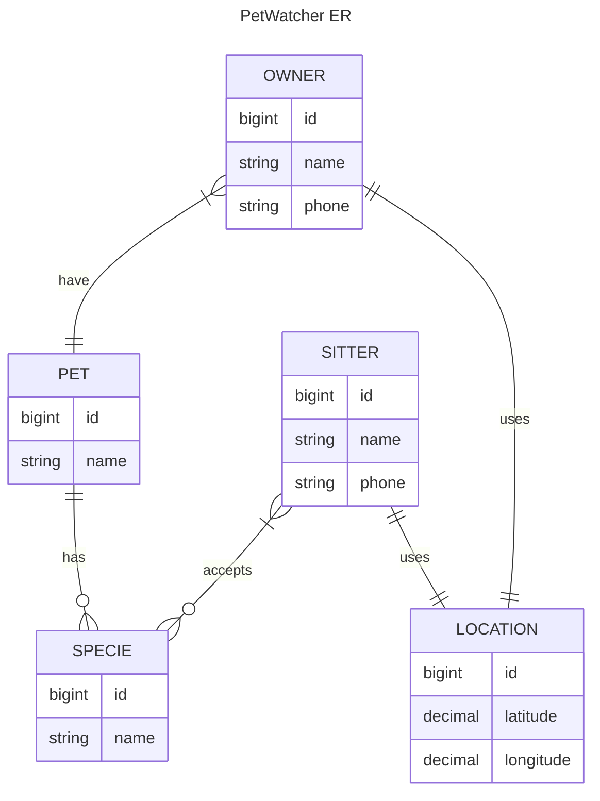

# PetWatcher

*Original Tagline*: **Connecting pet sitters with pet owners**

## Problem Statement (Original)
Leverage Fido Tabby to connect pet owners with people can watch pets in their local area

## Target Audience (Original)
- Pet owners
- Pet sitters

## Features

- [ ] Find sitter by proximity
- [ ] Filter by breed
- [ ] Owner/Pet/Sitter picture
- [ ] Accept match service in-app (Match before providing phone     )
- [ ] Schedule system
- [ ] Rating system (stars and comments)
- [ ] Pet details

## Entity Diagram

