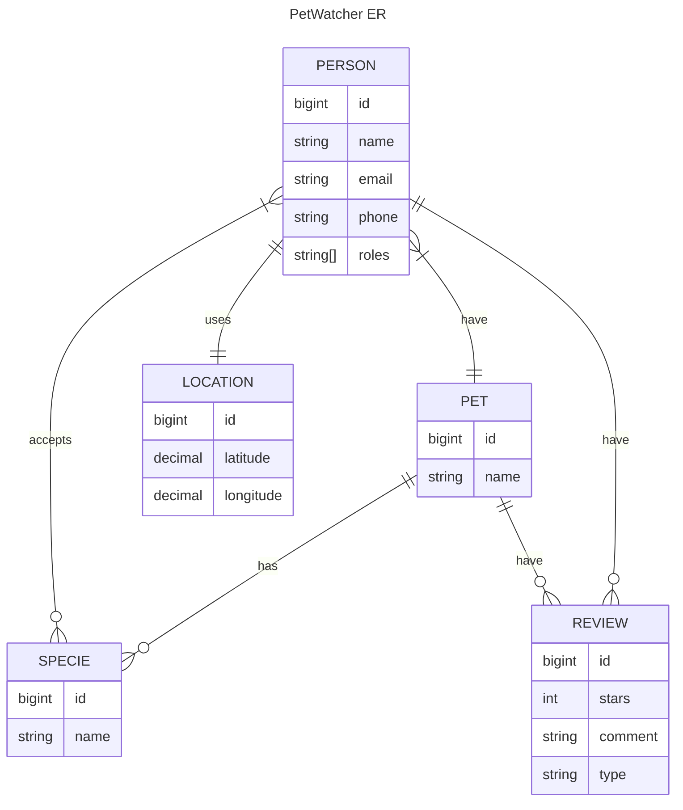

# PetWatcher

*Original Tagline*: **Connecting pet sitters with pet owners**

## Problem Statement (Original)
Leverage Fido Tabby to connect pet owners with people can watch pets in their local area

## Target Audience (Original)
- Pet owners
- Pet sitters

## Features

- [X] Find sitter by proximity
- [X] Dual profile (Sitter and Owner at the same time)
- [X] Rating system (stars and comments)
- [ ] Owner/Pet/Sitter picture
- [ ] Pet details
- [ ] Accept match service in-app (Match before providing phone)
- [ ] Filter by breed
- [ ] ~~Schedule system~~

## Steps

- Authentication / Registration
- Geolocation methods (proximity) - Sávio
- Pages
  - Pet CRUD - Franco
  - Review CRUD - Nehama

## Technical details

- Authentication: Devise (out of box)

## Entity Diagram

